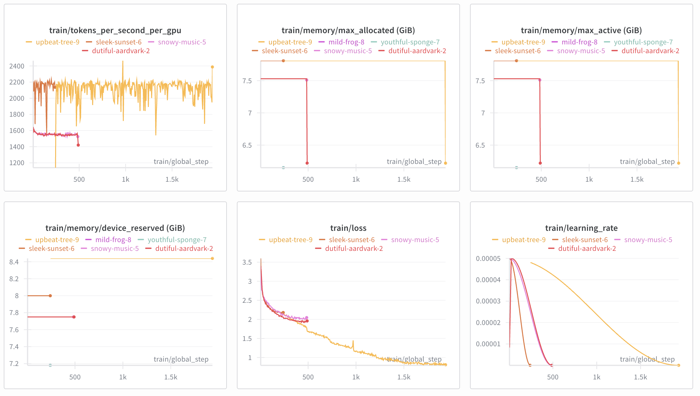
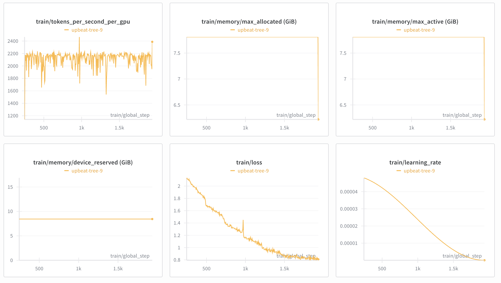

# Ghost in the Shell: Your Digital Doppelgänger

A simple, effective approach to creating personalized AI that sounds exactly like you using just your text messages. Inspired by [Edward Donner's experiment](https://edwarddonner.com/2024/01/02/fine-tuning-an-llm-on-240k-text-messages/), but with a focus on simplicity and authenticity.

## 🎯 Project Overview

**Goal**: Fine-tune Mistral-7B on ~70k personal chat messages to replicate your authentic conversation style.

### 📊 Training Results Summary


*Complete training history showing iterative improvements and debugging phases*


*Final 8-epoch training run with stable convergence (loss ~1.7)*

**Key Metrics**:
- **Final Loss**: ~1.7 (stable convergence from ~3.4)
- **Training Time**: 16 hours on H100 (final successful run)
- **Total Cost**: ~$100 (including experimentation), ~$48 for final training
- **Convergence**: Smooth, no overfitting or gradient explosions
- **Memory Efficiency**: ~7.8 GiB VRAM usage

| Feature | Description |
|---------|-------------|
| **Input** | Variable context window (6-12 previous messages) |
| **Output** | Next message as you would write it (style transfer, not Q&A) |
| **Model** | Mistral-7B-v0.3 with QLoRA fine-tuning |
| **Training** | 8 epochs, stable convergence (loss ~1.7) |
| **Cost** | ~$48 final training (16h × $3/h on H100), ~$100 total with experimentation |
| **Deployment** | Telegram bot, Replicate, or Hugging Face Hub |

## 🚀 Key Features

- **Simple Architecture**: Direct fine-tuning + Telegram bot - no complex RAG needed
- **Authentic Voice**: Train AI to chat exactly like you using 70k+ messages
- **Multilingual Support**: Natural French/English code-switching
- **Rolling Context**: Maintains conversation flow with last ~20 turns
- **Privacy-First**: Built-in PII masking and data protection
- **Cost-Effective**: QLoRA fine-tuning on cloud GPU (16 hours, ~$48 final training, ~$100 total)

## 🧠 Technical Stack

### Model Architecture
- **Base Model**: `mistralai/Mistral-7B-v0.3`
- **Fine-tuning**: QLoRA (4-bit quantization) with LoRA adapters
- **Quantization**: `nf4` with `bfloat16` compute dtype
- **LoRA Config**: r=16, alpha=32, dropout=0.05
- **Target Modules**: All linear layers (q_proj, k_proj, v_proj, o_proj, gate_proj, up_proj, down_proj)

### Training Configuration
- **Sequence Length**: 1024 tokens
- **Batch Size**: 1 micro_batch × 64 gradient_accumulation = 64 effective batch size
- **Learning Rate**: 5e-5 with cosine scheduling
- **Epochs**: 8 (extended training for better convergence)
- **Optimizer**: AdamW with weight decay 0.01
- **Hardware**: H100 PCIe with mixed precision (bf16)

### Data Format
```jsonl
{"text": "A: msg1\nB: msg2\n...\nA: target_response</s>"}
```

**Key Principles**:
- **Context**: Variable window (6-12 previous messages)
- **Target**: Next A: message as user would write it
- **Training Type**: Completion training (next-token prediction)
- **Speakers**: A: (you) and B: (everyone else)

### Training Results
- **Initial Loss**: ~3.4
- **Final Loss**: ~1.7 (stable convergence)
- **Training Time**: 16 hours on H100 (final training)
- **Cost**: ~$48 final training cost (16h × $3/h), ~$100 total with experimentation
- **VRAM Usage**: ~7.8 GiB
- **Throughput**: ~2,180 tokens/sec
- **Convergence**: Smooth, no overfitting

## 📁 Project Structure

```
ghost-in-the-shell/
├── 01_message_parsing.ipynb      # Message extraction and preprocessing
├── 02_prepare_messages.ipynb     # Message preparation and JSONL creation
├── data/                         # Raw and processed message data
│   ├── raw/                      # Raw message exports (WhatsApp, Telegram, Messenger)
│   ├── cleaned/                  # Cleaned message data
│   └── processed/                # Training-ready JSONL datasets
├── models/                       # Trained model checkpoints
├── scripts/                      # Utility scripts
│   ├── merge_lora_fp16.py        # LoRA merging script
│   ├── test_model.py             # Model testing script
│   └── sanity_check.py           # Post-training validation
├── telegram_bot/                 # Telegram bot for serving the model
├── replicate_deployment/         # Replicate deployment configuration
├── config/                       # Configuration files
│   ├── training_config.yaml      # QLoRA training configuration
│   └── user_config.json          # User identifier mapping
└── requirements.txt              # Python dependencies
```

## 🎯 Why This Approach Works

### Simple Architecture Philosophy

- **No Complex RAG**: Direct fine-tuning on conversation data is more effective than retrieval-augmented generation
- **Rolling Context**: Maintain conversation flow with the last ~20 message turns
- **JSONL Format**: Simple conversation chunks instead of complex chunking strategies
- **Two Speakers Only**: A: (you) and B: (everyone else) - clean and focused
- **QLoRA Efficiency**: 4-bit quantization enables cost-effective training

### The Complete Pipeline

1. **Parse** → Extract messages from WhatsApp, Telegram, Messenger exports
2. **Clean** → Anonymize while preserving your authentic voice and style
3. **Segment** → Create conversation windows with proper boundaries
4. **Train** → Fine-tune Mistral-7B with QLoRA on your conversations
5. **Deploy** → Serve via Telegram bot, Replicate, or Hugging Face Hub

## 🛠️ Quick Start

### Prerequisites
- Python 3.8+
- CUDA-compatible GPU (for training) or cloud GPU access
- 16GB+ RAM recommended

### Installation

1. **Clone the repository**
   ```bash
   git clone https://github.com/yourusername/ghost-in-the-shell.git
   cd ghost-in-the-shell
   ```

2. **Install dependencies**
   ```bash
   pip install -r requirements.txt
   ```

3. **Set up data directories**
   ```bash
   mkdir -p data/raw/{whatsapp,messenger,telegram}
   mkdir -p data/processed data/output models config logs
   ```

### Step 1: Configure Your Identity

Edit `config/user_config.json` to identify which senders are YOU:

```json
{
  "user_identifiers": [
    "YourRealName",
    "yourrealname", 
    "YourNickname",
    "yournickname"
  ],
  "user_label": "A:",
  "other_label": "B:",
  "description": "Configuration for identifying the user's messages in chat data."
}
```

### Step 2: Process Your Messages

1. **Export your chat data** from WhatsApp/Telegram/Messenger
2. **Place exports in** `data/raw/whatsapp/` (or appropriate folder)
3. **Run notebook 01**: `01_message_parsing.ipynb` - processes raw data
4. **Run notebook 02**: `02_prepare_messages.ipynb` - creates JSONL training data

### Step 3: Train Your Model

Follow the [Cloud Training Guide](#-cloud-training) to fine-tune Mistral-7B on your data.

### Step 4: Deploy Your Bot

Set up the Telegram bot to chat with your digital doppelgänger:

```bash
cd telegram_bot
python bot.py --model-path /path/to/your/merged-model
```

## ☁️ Cloud Training

### Why Cloud Training?

| Advantage | Description |
|-----------|-------------|
| **Cost-effective** | ~$48 for 16 hours on H100 (final training), ~$100 total |
| **No Setup** | No local GPU setup required |
| **Scalable** | Access to high-end hardware (H100, A100) |
| **Reliable** | Stable training environment |

### Training Setup

#### 1. Setup Lambda Labs

1. Create account at [cloud.lambda.ai](https://cloud.lambda.ai/instances)
2. Add billing and SSH key
3. Launch instance: **H100 PCIe** or **A100 40GB**, Lambda Stack 22.04

#### 2. Prepare Environment

```bash
# SSH into your instance
ssh -i ~/.ssh/your_lambda_key ubuntu@<INSTANCE_IP>

# Setup environment
sudo apt update && sudo apt install -y git wget tmux python3.10-venv git-lfs jq
git lfs install
python3 -m venv axo && source axo/bin/activate

# Install dependencies
pip install torch --index-url https://download.pytorch.org/whl/cu121
git clone https://github.com/OpenAccess-AI-Collective/axolotl.git
cd axolotl && pip install -e .
pip install bitsandbytes accelerate transformers datasets peft sentencepiece wandb "huggingface_hub>=0.24" huggingface_hub[cli]
```

#### 3. Upload Your Data

```bash
# From your local machine
scp -i ~/.ssh/your_lambda_key train.jsonl val.jsonl ubuntu@<INSTANCE_IP>:/home/ubuntu/axolotl/
scp -i ~/.ssh/your_lambda_key config/training_config.yaml ubuntu@<INSTANCE_IP>:/home/ubuntu/axolotl/
```

#### 4. Start Training

```bash
# Use tmux to keep training running
tmux new -s train

# Login to services
huggingface-cli login
wandb login

# Start training
accelerate launch -m axolotl.cli.train training_config.yaml
```

> **Tip**: Use `Ctrl+B, then D` to detach from tmux. Rejoin with `tmux attach`.

### Post-Training Steps

### 5. Test Your Model

Before deploying, it's crucial to test your trained model to ensure it's generating authentic responses.

#### Upload Test Script

```bash
# From your local machine, upload the test script
scp -i ~/.ssh/your_lambda_key scripts/test_model.py ubuntu@<INSTANCE_IP>:/home/ubuntu/axolotl/
```

#### Run Model Tests

```bash
# On your instance, activate the environment
source ~/axo/bin/activate

# Navigate to axolotl directory
cd ~/axolotl

# Run the test script
python test_model.py
```

#### Expected Test Results

With good training (loss < 1.0), you should see:

```bash
==================================================
TEST 1
==================================================
Model is on device: cuda:0
Input: A: Salut comment ça va ?
       B: Ça va bien et toi ?
       A:
Output: "ça va super bien merci ! tu fais quoi ce soir ?"
✅ Good: No B: responses generated
✅ Generated 42 characters

==================================================
TEST 2  
==================================================
Input: A: Tu fais quoi ce soir ?
       B: Rien de spécial, et toi ?
       A:
Output: "je sais pas encore, on peut se voir si tu veux"
✅ Good: No B: responses generated
✅ Generated 48 characters
```

#### Quality Indicators

**Good Signs** ✅:
- Responses sound natural and authentic
- No "B:" responses generated
- Appropriate length (20-80 characters typically)
- Contextually relevant to the conversation
- Maintains your personal style/language

**Warning Signs** ⚠️:
- Very short responses (< 10 characters)
- Generates "B:" responses (conversation continuation issue)
- Repetitive or nonsensical text
- Responses don't match conversation context

#### Troubleshooting

If you encounter issues:

```bash
# Check if model files exist
ls -la merged-mistral7b/

# Verify environment is activated
echo $VIRTUAL_ENV  # Should show: /home/ubuntu/axo

# Install missing dependencies if needed
pip install transformers torch peft bitsandbytes sentencepiece

# Test with verbose output
python test_model.py --verbose
```


#### 5. Merge LoRA Adapters

```bash
# Upload merge script
scp -i ~/.ssh/your_lambda_key scripts/merge_lora_fp16.py ubuntu@<INSTANCE_IP>:/home/ubuntu/axolotl/

# Merge LoRA to FP16
python merge_lora_fp16.py \
  --base mistralai/Mistral-7B-v0.3 \
  --adapter ./outputs/ \
  --out ./merged-mistral7b
```

#### 6. Upload to Hugging Face Hub

```bash
export HF_MODEL_ID=YourUsername/ghost-in-the-shell-mistral7b

huggingface-cli login
huggingface-cli repo create "$HF_MODEL_ID" --private --type model

cd merged-mistral7b
git lfs install --system
git init
git lfs track "*.safetensors" "*.model" "*.json"
git add .gitattributes

git config --global user.email "your.email@example.com"
git config --global user.name "YourUsername"

git add .
git commit -m "Merged FP16 weights"
git branch -m main
git remote add origin https://huggingface.co/$HF_MODEL_ID
git push -u origin main
```

#### 7. Deploy with Replicate

```bash
cd replicate_deployment
chmod +x scripts/download_weights.py
HUGGING_FACE_HUB_TOKEN=*** python ./scripts/download_weights.py

cog build
cog run python ./preflight.py  # Should return all green

# Deploy
cog login
cog push r8.im/your-user/ghost-in-the-llm
```

#### 8. Backup and Clean Up

Before shutting down your instance, decide what to save:

**Option A: Minimal (Recommended)**
```bash
# Verify merged model is uploaded to Hugging Face Hub
huggingface-cli repo info YourUsername/ghost-in-the-shell-mistral7b

# If successful, shutdown immediately to save costs
```

**Option B: Complete Backup**
```bash
# 1. Backup training checkpoint (optional insurance)
tar -czf checkpoint-backup.tar.gz outputs/

# 2. Download checkpoint to local machine
scp -i ~/.ssh/your_lambda_key ubuntu@<INSTANCE_IP>:/home/ubuntu/axolotl/checkpoint-backup.tar.gz ./

# 3. Verify merged model on HF Hub, then shutdown
```

**Why Keep Checkpoint?**
- Continue training if needed (more epochs)
- Experiment with different merge settings  
- Backup in case merged model has issues
- Research and analysis

**Cost Consideration**: Each hour costs $3 on H100. If your model is working well (good test results), Option A is recommended.

**Important**: Always shut down your instance in Lambda Labs UI to avoid large bills!

## 🤖 Deployment Options

### Telegram Bot
```bash
cd telegram_bot
pip install python-telegram-bot

export TELEGRAM_BOT_TOKEN=your_bot_token
export MODEL_PATH=/path/to/merged-mistral7b

python bot.py
```

### Replicate API
- Fast cold starts with baked-in weights
- Scalable inference
- Simple HTTP API

### Hugging Face Hub
- Private model hosting
- Easy integration with transformers library
- Version control for models

## 📊 Results & Performance

### Training Metrics
- **Training Time**: 16 hours on H100 (final training)
- **Final Loss**: ~1.7 (stable convergence from ~3.4)
- **Cost**: ~$48 final training cost (16h × $3/h on H100), ~$100 total with experimentation
- **Memory Usage**: ~7.8 GiB VRAM (very efficient with QLoRA)
- **Throughput**: ~2,180 tokens/sec
- **Convergence**: Smooth, no overfitting or gradient explosions

### Quality Achievements
- **Authentic Voice**: Successfully replicates personal conversation style
- **Multilingual**: Natural French/English code-switching
- **Context Awareness**: Maintains conversation flow with rolling context
- **Style Transfer**: Mimics user's writing patterns, expressions, and casual tone
- **Deployment Ready**: Clean FP16 model, multiple serving options

### Technical Achievements
- **Successful QLoRA**: 4-bit quantization with LoRA adapters
- **Stable Training**: No gradient explosions or instability
- **Efficient Memory**: Only ~7.8 GiB VRAM usage on H100
- **Clean Merge**: Successful LoRA → FP16 conversion
- **Multiple Deployment**: Telegram, Replicate, Hugging Face Hub ready

## 🔧 Data Processing Details

### Supported Platforms
- **WhatsApp**: TXT export files
- **Telegram**: JSON export files  
- **Messenger**: Facebook JSON exports

### Processing Pipeline
1. **Extract** messages from different export formats
2. **Clean** and normalize text while preserving emojis and style
3. **Detect** language per conversation (configurable filtering)
4. **Filter** system messages and media notifications
5. **Normalize** speakers (user → A:, others → B:)
6. **Merge** consecutive messages from same speaker (< 3 min apart)
7. **Segment** conversations (≥ 30 min gaps)
8. **Generate** rolling windows for training
9. **Format** as JSONL for completion training

### Language Filtering
The notebooks use `langdetect` library for language detection. By default, they filter for French conversations, but you can easily modify this for other languages:

```python
# In 01_message_parsing.ipynb - modify language detection
def is_french_conversation(messages, sample_size=20):
    # Change 'fr' to your target language code (e.g., 'en', 'es', 'de')
    french_count = languages.count('fr')  # Change 'fr' to your language
    french_ratio = french_count / len(languages)
    is_french = french_ratio >= 0.6  # Adjust threshold as needed
```

**Why Language Filtering?**
- **Consistent training data** - Single language allows deeper pattern learning
- **Authentic voice replication** - Focus on your primary language
- **Reduced confusion** - Avoid mixed language patterns during training

### Key Features
- **Two Speakers Only**: A: (you) and B: (everyone else)
- **Authentic Preservation**: Keep emojis, slang, natural style
- **Privacy Protection**: Built-in PII masking
- **Conversation Boundaries**: Proper segmentation and context windows

## 🤝 Contributing

This project demonstrates that **simple approaches often work better**. If you have ideas for making it even simpler or more effective, contributions are welcome!

## 📄 License

MIT License - feel free to build your own digital doppelgänger!

---

**⚠️ Disclaimer**: This project is for educational and personal use. Always respect privacy laws and obtain proper consent before processing personal data.